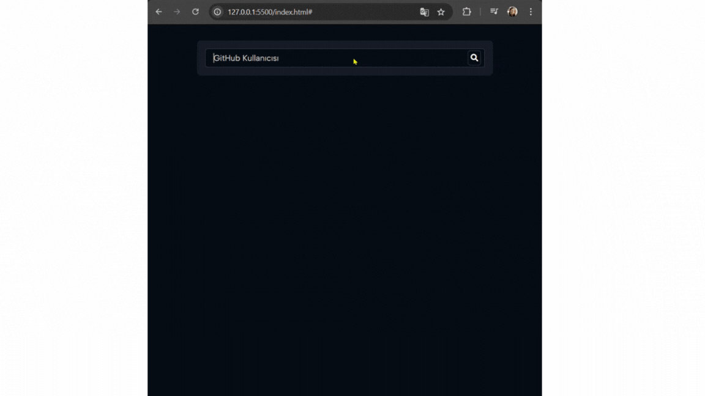

# Github-profil-card

Bu proje, GitHub kullanıcılarının profil bilgilerini görüntüleyen basit ve şık bir kart uygulamasıdır. Uygulama, GitHub API'si üzerinden kullanıcı verilerini çekerek, ad, kullanıcı adı, takipçi sayısı, takip edilen kişi sayısı, repo sayısı gibi bilgileri gösterir.

## Gif

